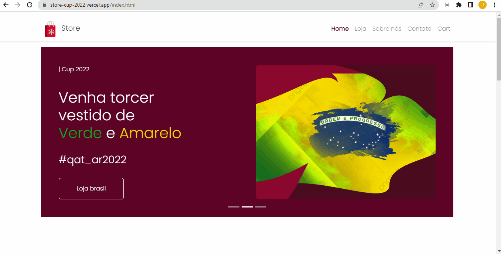
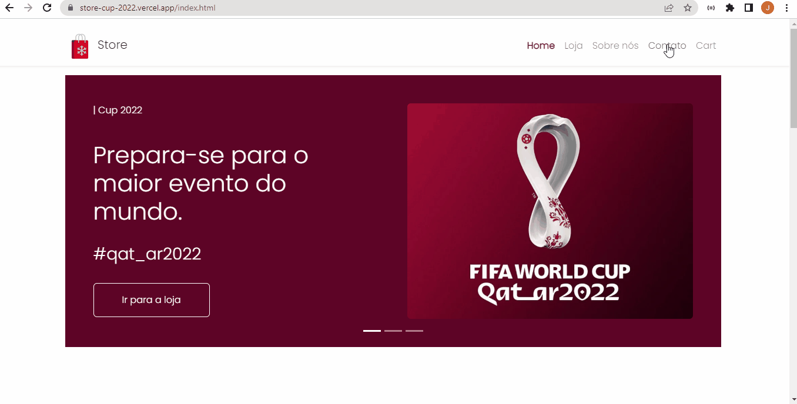

# Store - your best option for shopping.
</br>


## :bookmark_tabs:Summary

1. [Introduction](#Introduction)
2. [Demo](#live-demo)
3. [Features and some gif's ](#features-and-demo)
4. [layout mobile ](#layout-mobile)
5. [Technologies](#Technologies)
6. [Installation](#Installation)
7. [My opinion about this project](#opinion)


<div id="Introduction">
</br>

## :page_facing_up:Introduction
This project is an e-commerce template website that sells some products related to world cup 2022. 
```All datas and images used here are static```

</div>
</br>

<div id="live-demo">

See this project running, clique at the link below.
### :camera: [LIVE DEMO](https://store-cup-2022.vercel.app/index.html) :video_camera:
</div>
</br>


<div id="features-and-demo">

## :checkered_flag: Features
Here you will see the main resources used in this project, as well as some Gif's.
### Home
<p>Know a little about the website and our business.</p>

<br/><br/>

### Store
<p>See all our products on this page and choose which one you want to buy.</p>

<br/><br/>

### Cart
<p>After selecting which products you want, it's time to complete the purchase.</p>

<br/><br/>

### About us 
<p>The history and experience of the Store is described in this section.</p>

<br/><br/>

### Contact 
<p>Talk to the Store team, it's easy and simple.</p>

<br/><br/>


<div id="layout-mobile">

## :iphone: Layout mobile
<p>See the application running on the mobile screen.</p>

</br></br>

</div>

<div id="Technologies">

## :bar_chart: Technologies

##### :one: Bootstrap
[Bootstrap docs](https://getbootstrap.com/docs/5.2/getting-started/introduction/). - "Bootstrap is a powerful, feature-packed frontend toolkit..."
</br>

##### :two:  Bootstrap icons
[Bootstrap Icons docs](https://icons.getbootstrap.com/). - "Free, high quality, open source icon library with over 1,600 icons..."

</div>
</br><br>

<div id="Installation">

## :computer: Installation

#### Step 1 - Download this project
  ##### Option :one: - Download Zip 
  ##### Option :two: - Cloning a repository - [how to do this](https://docs.github.com/en/repositories/creating-and-managing-repositories/cloning-a-repository). 
</br>

</div>

<div id="opinion">

## :trophy: Testimony :trophy:
This project helped me understand how powerful Bootstrap can be on its own and how fast you can build amazing apps with it.
</div>
</br>


</br></br>

Made with :heart: by Jabes Enock